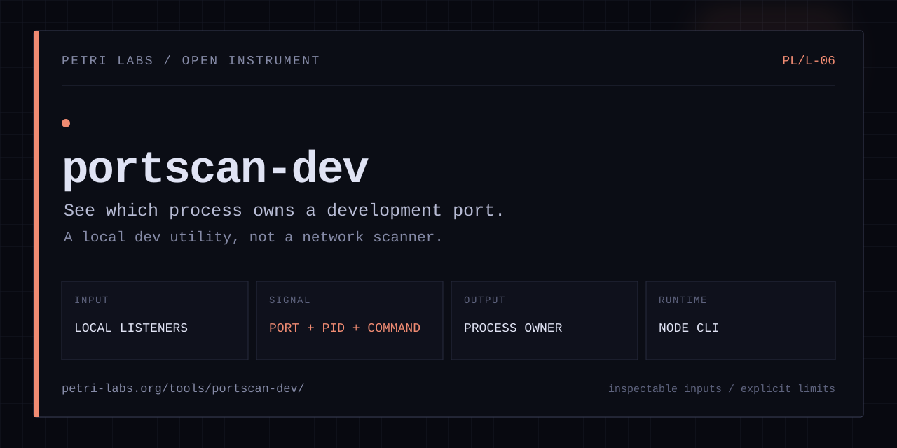

<p align="center">
  
</p>

<p align="center">
  <a href="https://www.npmjs.com/package/@barissozudogru/portscan-dev"></a>
  <a href="https://www.npmjs.com/package/@barissozudogru/portscan-dev"></a>
  <a href="https://github.com/barissozudogru/portscan-dev/actions/workflows/ci.yml"></a>
  <a href="./LICENSE"></a>
</p>

# portscan-dev

`portscan-dev` scans your system for processes listening on development ports (3000-9999, plus well-known service ports such as PostgreSQL, Redis, MongoDB, Ollama, RabbitMQ, Memcached and the Docker daemon) and displays PID, process name, uptime, and command line. When a process occupies a required port, kill it directly without manual `lsof` or `ps` commands.

This is a local development process inspector. It is not a network discovery or security scanner.

[Tool page](https://petri-labs.org/tools/portscan-dev/) · [npm](https://www.npmjs.com/package/@barissozudogru/portscan-dev) · [Source](https://github.com/barissozudogru/portscan-dev)

## Installation

```bash
npm install -g @barissozudogru/portscan-dev
```

## Usage

```bash
# Scan active development ports
portscan-dev

# Kill process on port 3000
portscan-dev --kill 3000

# Kill processes on multiple ports
portscan-dev --kill 3000,8080,4000

# Kill with a specific signal
portscan-dev --kill 3000 --signal SIGKILL

# Filter scan to a port range
portscan-dev --port-range 3000-5000

# Output results as JSON
portscan-dev --json
```

A kill counts as successful only once nothing is left listening on the port. Every process holding the port is signaled, and a process that traps or ignores the signal is reported as a failure, together with the pid(s) still holding the port.

## Options

| Flag | Alias | Description | Default |
|---|---|---|---|
| `--kill <ports>` | `-k` | Comma-separated list of ports to kill | - |
| `--signal <signal>` | `-s` | Signal to send when killing (e.g. `SIGTERM`, `SIGKILL`) | `SIGTERM` |
| `--port-range <start-end>` | - | Filter scan to a port range, e.g. `3000-9000` | - |
| `--json` | `-j` | Output results as JSON | - |
| `--version` | `-v` | Print version and exit | - |
| `--help` | `-h` | Show help | - |

## Output Example

```
PORT      PID       PROCESS               UPTIME            COMMAND

3000      28471     node                  00:12:04          node server.js
3001      28512     node                  00:11:58          npx react-scripts start
4200      29104     ng                    00:08:31          ng serve --port 4200
5173      31002     vite                  00:02:17          vite --host
8080      22891     python3               01:04:42          python3 -m http.server 8080
5432      1084      postgres              14:22:10          postgres -D /usr/local/var/postgresql@14/data
6379      1091      redis-server          14:22:08          redis-server *:6379
```

A live verification with `python3 -m http.server 4567` returned the Python process owning port 4567. The temporary process was stopped after verification.

If this saves you time, consider [starring the repository](https://github.com/barissozudogru/portscan-dev). It helps other developers find it.

## Scanned Ports

By default, `portscan-dev` scans ports 3000-9999 plus well-known local service ports for databases, queues, containers, and model runtimes. Pass `--port-range <start-end>` to specify a custom range.

## Platform Support

| Platform | Detection tool | Notes |
|---|---|---|
| macOS | `lsof` | Available by default |
| Linux | `ss` | Available in `iproute2` |
| Linux (fallback) | `lsof` | Fallback when `ss` is missing |

Process uptime and full command are resolved via `ps` on supported platforms.

## Exit Codes

| Code | Meaning |
|---|---|
| `0` | Success (scan completed or ports killed) |
| `1` | Failure (one or more ports could not be killed) |

## License

[MIT](./LICENSE)
