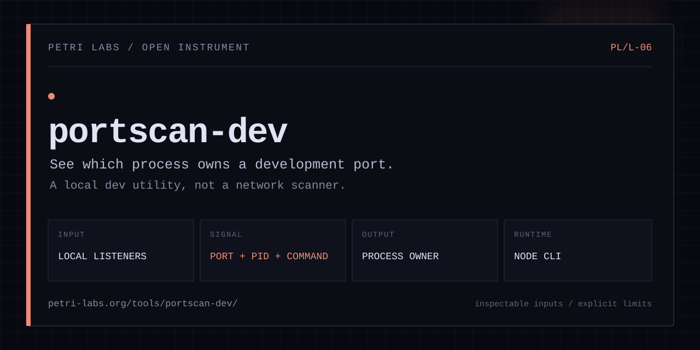

<p align="center">
  
</p>

<p align="center">
  <a href="https://www.npmjs.com/package/@barissozudogru/portscan-dev"></a>
  <a href="https://www.npmjs.com/package/@barissozudogru/portscan-dev"></a>
  <a href="https://github.com/barissozudogru/portscan-dev/actions/workflows/ci.yml"></a>
  <a href="./LICENSE"></a>
</p>

# portscan-dev

`portscan-dev` scans your system for processes listening on development ports (3000-9999, plus well-known service ports such as PostgreSQL, Redis, MongoDB, Ollama, RabbitMQ, Memcached and the Docker daemon) and displays PID, process name, uptime, and command line. When a process occupies a required port, kill it directly without manual `lsof` or `ps` commands.

This is a local development process inspector. It is not a network discovery or security scanner.

[Tool page](https://petri-labs.org/tools/portscan-dev/) · [npm](https://www.npmjs.com/package/@barissozudogru/portscan-dev) · [Source](https://github.com/barissozudogru/portscan-dev)

## Installation

```bash
npm install -g @barissozudogru/portscan-dev
```

## Usage

```bash
# Scan active development ports
portscan-dev

# Kill process on port 3000
portscan-dev --kill 3000

# Kill processes on multiple ports
portscan-dev --kill 3000,8080,4000

# Kill with a specific signal
portscan-dev --kill 3000 --signal SIGKILL

# Filter scan to a port range
portscan-dev --port-range 3000-5000

# Output results as JSON
portscan-dev --json
```

A kill counts as successful only once nothing is left listening on the port. Every process holding the port is signaled, and a process that traps or ignores the signal is reported as a failure, together with the pid(s) still holding the port.

## Options

| Flag | Alias | Description | Default |
|---|---|---|---|
| `--kill <ports>` | `-k` | Comma-separated list of ports to kill | - |
| `--signal <signal>` | `-s` | Signal to send when killing (e.g. `SIGTERM`, `SIGKILL`) | `SIGTERM` |
| `--port-range <start-end>` | - | Filter scan to a port range, e.g. `3000-9000` | - |
| `--json` | `-j` | Output results as JSON | - |
| `--version` | `-v` | Print version and exit | - |
| `--help` | `-h` | Show help | - |

## Reading the report

The table reports port, PID, process name, uptime, and command line for local
listeners. Use `--json` for structured output. Review the owning process before
using `--kill`; command lines can include sensitive arguments, so inspect output
before sharing it.

## Scanned Ports

By default, `portscan-dev` scans ports 3000-9999 plus well-known local service ports for databases, queues, containers, and model runtimes. Pass `--port-range <start-end>` to specify a custom range.

## Platform Support

| Platform | Detection tool | Notes |
|---|---|---|
| macOS | `lsof` | Available by default |
| Linux | `ss` | Available in `iproute2` |
| Linux (fallback) | `lsof` | Fallback when `ss` is missing |

Process uptime and full command are resolved via `ps` on supported platforms.

## Exit Codes

| Code | Meaning |
|---|---|
| `0` | Success (scan completed or ports killed) |
| `1` | Failure (one or more ports could not be killed) |

## Development and support

Report problems through [GitHub issues](https://github.com/barissozudogru/portscan-dev/issues). See [CONTRIBUTING.md](./CONTRIBUTING.md) for the contribution workflow. For vulnerabilities, follow [SECURITY.md](./SECURITY.md).

To build and test a source checkout with Node.js 22:

```bash
npm ci
npm test
npm run build
```

The default branch can contain changes that have not yet been published to npm.

## License

[MIT](./LICENSE)
